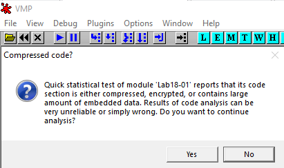
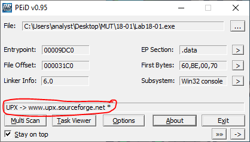
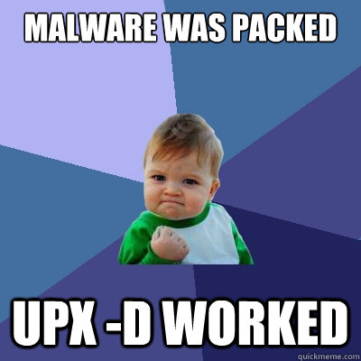

# Unpacking Malware

## Table of contents
- [Why Packers?](#why-packers)
- [Packed Programs Stub](#packed-programs-stub)
- [Resolving Imports](#resolving-imports)
- [The Tail Jump](#the-tail-jump)
- [Identifying Packed Programs](#identifying-packed-programs)
- [Unpacking Methods](#unpacking-methods)
    - [Automated Unpacking](#automated-unpacking)
    - [Manual Unpacking](#manual-unpacking)
<!-- to fix later -->
## Why Packers?
Packers, are often employed by malware authors to avoid detection by anti-virus software. Typically anti-virus works on static signatures, and if a malware author gets just a little creative they can pack their malware, removing a lot of the previous indicators used by AV for detection, rendering previous detection methodology useless.

## Packed Programs Stub

When a normal executable file is ran, the OS loads it in its entirety. However, if the executable file is packed, the only thing the OS loads is what we call the "stub", a much smaller piece of code that loads the actual executable code in memory at run time. If an analyst were to conduct basic static analysis on the packed program they would only be doing so on the stub rather than the entire program.

## Resolving Imports

Standard windows Portable Executables (PEs) typically loads all relevant Dynamic Linked Libraries (DLLs) it requires at compile time for them to run properly. When a PE is packed alot of the time this import information is not available until runtime. The stub previously mentioned will resolve required DLLs in one of 3 common ways:

1. Most used approach involves the stub using the [LoadLibrary](https://learn.microsoft.com/en-us/windows/win32/api/libloaderapi/nf-libloaderapi-loadlibrarya) and [GetProcAddress](https://learn.microsoft.com/en-us/windows/win32/api/libloaderapi/nf-libloaderapi-getprocaddress) functions. 
    - In this instance the stub will call the LoadLibrary function on each of the DLLs in memory and then utilize GetProcess to uncover the address of each imported function.

2. One additional approach packed programs may use is simply keeping the original import table intact.

3. Another approach involves keeping 1 import function from each imported DLL. This is still stealthier than the previous approach but still reveals intended DLLS from simple static analysis.

## The Tail Jump

If the unpacking stub of the executable has completed it's job, it must give control to the Original Entry Point (OEP) of the given executable, or another packing stub (sometimes executables can be packed multiple times). 

## Identifying Packed Programs

The following is a list of common signs to look for when trying to identify if malware is packed.

- The program has very few import functions, and particularly if the only imported functions are [LoadLibrary](https://learn.microsoft.com/en-us/windows/win32/api/libloaderapi/nf-libloaderapi-loadlibrarya) and [GetProcAddress](https://learn.microsoft.com/en-us/windows/win32/api/libloaderapi/nf-libloaderapi-getprocaddress). Some additional techniques, which will be covered in the manual unpacking examples include the use of [VirtualAlloc](https://learn.microsoft.com/en-us/windows/win32/api/memoryapi/nf-memoryapi-virtualalloc) and [CreateProcess](https://learn.microsoft.com/en-us/windows/win32/api/processthreadsapi/nf-processthreadsapi-createprocessa).
 

- When the program is opened in a dissassembler such as IDA Pro or Ghidra and only a small portion of code is identified, among a large chunck of data.
    - Large data section (in grey) observed while dissassembling a program in IDA.
    

- When opening a program in a debugger, a popup may occur stating the the program is packed
    - example from OllyDbg:
      
    
- The program has section names that indicate a particular packer was used.
    - from DiE
      
       

- The program has strange section sizes, for example a .text section with a raw data size of or close to zero and a nonzero virtual size.
    - Example from a Packed TinyMet trojan

    

- Using a tool that can specifically identify common packers
    - PE Identifier (PEiD)

    
    - Detect it Easy (DiE)

    

## Unpacking Methods

### Automated Unpacking

#### Example: A Simple Pop up PE with UPX

As seen below the hello_popup.exe and hello_popup.exe found at the following link: [Unpacking Samples](https://github.com/potato4974/Malware-Unpacking-and-Identifying-Process-Injection/blob/main/Unpacking_ProcessInjection_samples.7z). Both the Packed and unpacked version will run as the packer knows how to hand off control to the origional function. Notice that the size of the two binaries is markably different.

##### 1. Identifying that hello_popup - UPX.exe is packed
Although the name of the PE in this case is a dead giveaway, let's run through the motions of identifying that this executable is indeed packed.

- DiE of hello_popup - UPX

- IDA view of data sections vice Regular Functions
    - hello_popup - UPX.exe
    
    - The unpacked hello_popup.exe
    

##### 2. Unpacking hello_popup - UPX.exe
Given that you have certainty that UPX was used to packe this executable you can use the tool itself to unpack it as follows:

- Now observe that both executables have the same size, partially confirming that the file was unpacked successfully.

- DiE is no longer showing signs of UPX  

- IDA now shows a large amount of regular functions rather than data as well

Congratulations you have unpacked your first executable!

### Manual Unpacking

#### Example Unpacking UPX packed PE Software and hardware breakpoints.

- UPX -d did infact work, but that's too easy let's try and do the same but manually this time.

- Now we will take an example executable that uses a modified UPX in order to demonstrate how to manually unpack malware when threat actors put in the effort to hamper automated unpacking solutions.

- For this example we will be using the [executable from lab 18-1](https://github.com/mikesiko/PracticalMalwareAnalysis-Labs) from the[Practical Malware Analysis Textbook](https://github.com/mikesiko/PracticalMalwareAnalysis-Labs).

- Observing the PE through DiE and IDA, it is evident that this PE is packed.

- Load the sample into a dissassembler and try to identify where the tailjump is. Usually the tailjump will have a jump to a far off location within or near a block of undefined data. 

- Disable ASLR and search for the tail jump in x32dbg 
 
 

- Step over the tail jump to get to the Original Entry Point (OEP) of the program.

- Open Scylla, find the IAT and dump the unpacked executable.

- Using Scylla fix the dumped file to ensure that the IAT works and the program can access all of the imports it requires.

- Now you can confirm that the program is no longer packed with a modified UPX by inspecting it in DiE.

##### Another way with a hardware breakpoint
- Restart the program with X32dbg

- Since the memory address pushed onto the stack at the begining of the unpacking routine is poped a few instructions before the tailjump; a hardware breakpoint can be set to this position on the stack to triger a read breakpoint when that section of the stack is accessed.

- Running the program we now get to the popad which is only a few instructions away from the previously identifed tail jump. 

- After this point you can simply follow the previous instructions on repairing a dumped binary with Scylla covered earlier.

#### Example Process Hollowing
#### Packed Emotet Malware, Applying New Techniques to a Custom Packer.
In this section we will be unpacking a custom packed sample of [Emotet](https://en.wikipedia.org/wiki/Emotet) malware. This executable may be found within the [Samples 7Zip file in this repo](https://github.com/potato4974/Malware-Unpacking-and-Identifying-Process-Injection/blob/main/Unpacking_ProcessInjection_samples.7z)

##### Method 1 VirtualAlloc
In this first method we will be utilizing the windows API call [VirtualAlloc](https://learn.microsoft.com/en-us/windows/win32/api/memoryapi/nf-memoryapi-virtualalloc) and [CreateProcess](https://learn.microsoft.com/en-us/windows/win32/api/libloaderapi/nf-libloaderapi-getprocaddress). As for this instance of emotet makes use of a technique called [Process Hollowing](https://attack.mitre.org/techniques/T1055/012/#:~:text=Process%20hollowing%20is%20a%20method%20of%20executing%20arbitrary,which%20can%20then%20be%20replaced%20with%20malicious%20code.) to essentially "inject" and execute arbitrary code within the memory address space of a seperate process.

- Looking at the executable in IDA there seems to be some missing information, particularly with the later data chunks on the right side.

- First you must load the emotet malware sample into a 32 bit debugger, for this example we will be using x32dbg. Once the malware is loaded, ensure you navigate to preferences and engine to disable Address Space Layout Randomization [ASLR](https://en.wikipedia.org/wiki/Address_space_layout_randomization) to return the normal address space to the base 400000. 

- Since we will already assume that this program is using [Process Hollowing](https://attack.mitre.org/techniques/T1055/012/#:~:text=Process%20hollowing%20is%20a%20method%20of%20executing%20arbitrary,which%20can%20then%20be%20replaced%20with%20malicious%20code.) for the purposes of "unpacking" this malware, lets hit the hotket Ctrl+G to go to expression search. When in Expression search you will type VirtualAlloc to search for instances of this windows API function call. 

- Now navigate to the first instance of VirtualAlloc in the CPU view. You will now notice that you are within the kernel32.dll, specifically at the codespace for the VirtualAlloc function. 

- To further our investigation we need to find what called the VirtualAlloc API call to determine if this is where the malware injected its malicious code. Click the the jump from the previous screen capture to navigate to where the VirtualAlloc function returns control to the main body of code, and place a breakpoint as seen below.
 

- Upon stepping over the breakpoint we can see the return method bring us back into the main address space of the decompiled program. Right click on the line you return to and follow it in the memory dump view.

- Scanning through the memory space we follow in the memory dump we do not see anything that could resemble injected code or an executable. 

- Next run the program until you once again reach the VirtualAlloc function, and as previously step over the return function to return to where the VirtualAlloc was called.

- Now that you are following the address in the memory dump scan around and look for anything that stands out. In this instance you will see the magic header MZ or 4D 5A (in hex) and the words "This Program cannot be run in DOS mode" indicating that an executable was written to this space in memory! 

- Now that you can see what seems to be an executable in memory, right click on the MZ and follow it in the executables memory map. At his point you will see the block of memory that was allocated starting at address 630000(may be different for you as the memory allocation takes what memory space is available). Make note of the protection settings of this part of memory (ERW) meaning this area of memory can be Executed, Read from or Written to. 

- In order to save this section of memory as a file right click and dump memory to file as shown.

- Before we look at reverse engineering the file from memory there's some cleanup we need to do. First open the dumped file with a hex editor, in this example I am using [HxD hex editor](https://mh-nexus.de/en/hxd/).
 

- To finalize this method double check DiE and IDA to see if the malware did infact unpack. Notice the ammount of regular functions as opposed to the large ammount of data in the earlier view of the original executable through IDA.  

Method 2 CreateProcessW

